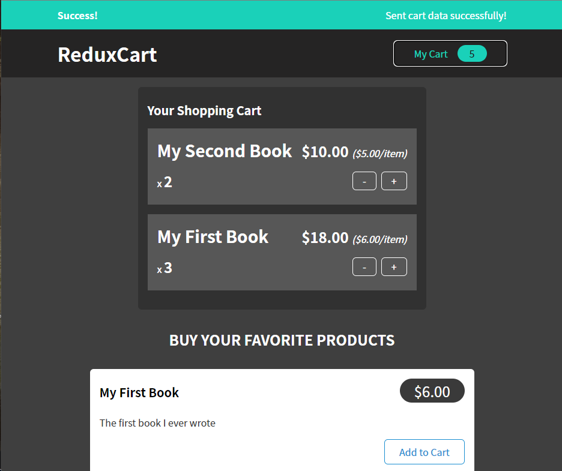

# Redux Cart 

Учебный проект по работе с React, Redux Toolkit, Firebase

## Технологии

* React
* Redux toolkit
* Firebase

## Функционал
* добавление/удаление заказов
* сохранение, отправка, получение состояния корзины в *Firebase*
* уведомления о состоянии запроса

## Запуск локально

`git clone https://github.com/andreyatx/redux-cart.git`

`npm i`

`npm i start`

## Скриншот

  

